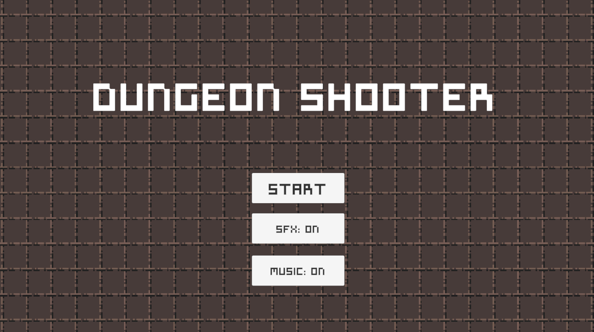

# Dungeon Shooter

Juego de Acción 2D básico.

Realizado como proyecto de curso, trabajando con:

- Sprites
- Manejo de Pixel Art
- Colisiones
- Triggers
- Layers
- Sonidos
- Estados
- Creación de UI básica
- Cambio de Escenas
- Persistencia de componentes

Movimiento con A-W-S-D, apunta con el ratón y dispara con el botón izquierdo.
Solo 2 Niveles (De momento)
Mejor visualización en pantalla completa.

[Link al juego](https://isj-code.itch.io/dungeon-shooter-test1)

## Más imágenes

